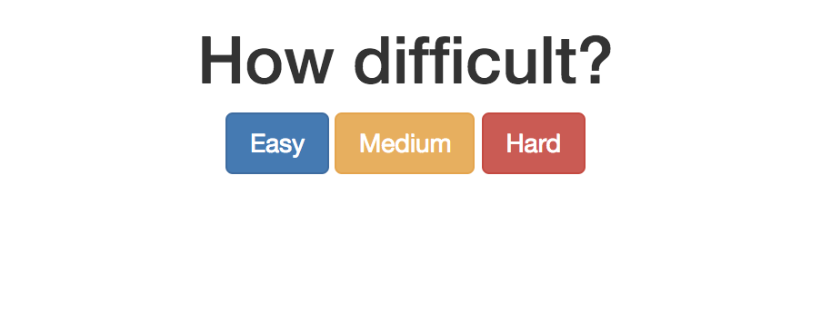
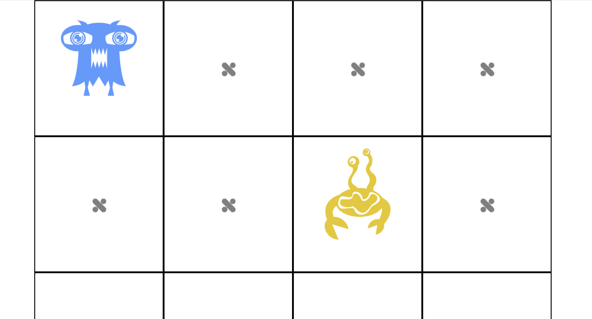

## Memory
Classic memory game in which a player tries to match overturned cards in pairs.

## Github Link:
[Memory GitHub](https://github.com/eddieatkinson/memory-game)

## Technologies used:
**Languages:**
* JavaScript
* HTML5
* CSS

**Frameworks:**
* jQuery
* Bootstrap

## Code snippets:
Gameplay:
``` javascript
$('button').click(function(){
        gridSize = $(this).attr("diff"); // We made this attribute up just for this purpose.

        cards.map((card, index)=>{
            cardsToUse.push(card, card); // So we have 2 of each card.
        })

        var memoryHTML = "";
        for(let i = 0; i < gridSize; i++){
            memoryHTML += `<div class="card col-sm-3">`;
                memoryHTML += `<div class="card-holder">`; // Indent for our own purposes.
                    memoryHTML += `<div class="card-front">${cardsToUse[i]}</div>`;
                    memoryHTML += `<div class="card-back"></div>`;
                memoryHTML += `</div>`;
            memoryHTML += `</div>`;
        }
        $('.mg-stuff').html(memoryHTML);

        $('.card-holder').click(function(){
            $(this).addClass('flip');
            // A card just flipped over.
            // Is there another one turned over already?
            // - If not, do nothing.
            // - If so, check and see if they match.

            var cardsUp = $('.flip');
            if(cardsUp.length === 2){
                // 2 cards up. Check. The only way the length can be 2 is if 2 elements have a class of 'flip'.
                var card1 = cardsUp[0];
                var card2 = cardsUp[1];
                if(card1.innerHTML === card2.innerHTML){
                    // MATCH!
                    cardsUp.addClass('matched');
                    cardsUp.removeClass('flip');
                }else{
                    // not a match
                    cardsUp.removeClass('flip');
                    cardsUp.addClass('temp-flip'); // in case someone clicks quickly, let's replace 'flip' with 'temp-flip'
                    setTimeout(()=>{
                        cardsUp.removeClass('temp-flip');
                    }, 1500);
                }
            }
        });
    });
```
Card-flip CSS:
``` css
img{
    /*Keep the image inside the parent no matter what.*/
    max-width: 100%;
}

/*Card is the grandparent and needs perspective.
This doesn't make card 3d, but everything else.*/
.card{
    perspective: 800px;
    border: 2px solid black;
    height: 300px;
}

.card-holder{
    position: relative;
    transform-style: preserve-3d;
    transition: 1s all;
    cursor: pointer;
}

.card-front, .card-back{
    position: absolute;
    top: 0;
    left: 0;
    backface-visibility: hidden; /*So we cannot see it when flipped.*/
}

.card-front{
    transform: rotateY(180deg);
}

.card-back{
    background: url('../images/logo-bw.png') no-repeat 50% 50%;
    height: 300px;
    width: 100%;
}

.flip, .temp-flip{
    transform: rotateY(-180deg);
}

.matched{
    transform: rotateY(540deg);
}
```

## Screenshots:
User can choose between three difficulty levels:



